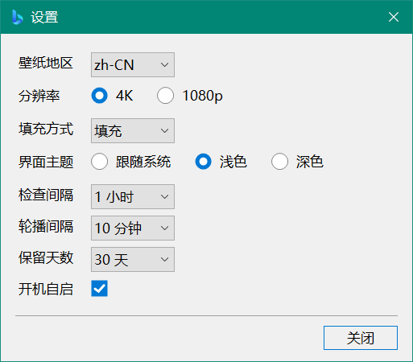
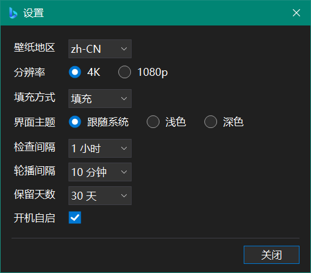
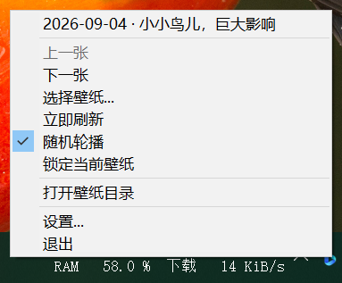
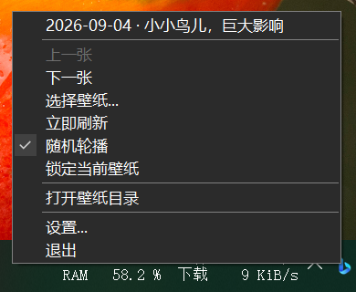
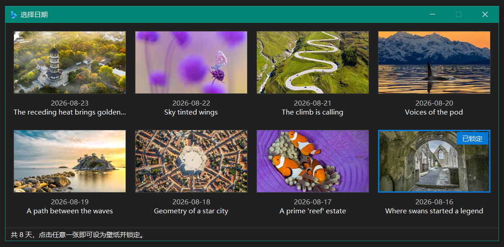

# 必应壁纸

一个干净、便携、开源的 Bing 每日壁纸客户端。

## 特性

- 常驻托盘，无主窗口，默认每小时检查一次今日壁纸
- 4K / 1080p 分辨率由客户端自己决定，不受接口返回值影响
- 支持 14 个常见市场，也可在配置文件里手填任意市场代码
- 壁纸选择窗口：「最近」8 天缩略图网格 +「收藏」，点击任意一张即设为壁纸并锁定
- 收藏夹：**收藏过的图片程序不会自动删除**，不受保留天数管辖；也可以自己往收藏目录里拷图片
- 可锁定某一张壁纸，不再随检查间隔自动更换
- 托盘菜单的「上一张 / 下一张」跟着你上次选图的地方走：在「最近」里选的就在 8 天里翻，
  在「收藏」里选的就在收藏夹里翻
- 六种填充方式：填充 / 适应 / 拉伸 / 平铺 / 居中 / 跨区
- 手写深色模式，**在 Windows 10 上同样有效**，可跟随系统实时切换
- 完全便携：配置、日志、壁纸全部位于程序目录，删除整个文件夹即可完整卸载
- 零第三方依赖，**单文件几百 KB 的可执行文件，无需安装任何运行时**

## 截图

| 浅色 | 深色 |
| :---: | :---: |
|  |  |
|  |  |



## 系统要求

- Windows 10 1903 (build 18362) 及以上，64 位
- **无需安装 .NET 运行时**：程序基于 .NET Framework 4.8，该版本自 Windows 10 1903 起随系统内置

## 安装与使用

1. 从 [Releases](../../releases) 下载 `BingWallpaper.zip` 并解压，得到一个 `BingWallpaper` 文件夹
2. 把这个文件夹放到一个**有写入权限**的位置，例如 `D:\Software\`
3. 启动文件夹里的 `BingWallpaper.exe`，托盘出现图标后即开始工作

### 配置文件

程序目录下的 `BingWallpaper.ini`，纯文本可手改，保存后重启程序生效：

```ini
[General]
Market=zh-CN              ; 市场代码，决定壁纸来自哪个频道；可设置为列出的 14 个常见市场，亦可填写任意代码
Resolution=UHD            ; 下载分辨率: UHD 或 1920x1080
Fit=Fill                  ; 填充方式: Fill / Fit / Stretch / Tile / Center / Span
Theme=System              ; 界面主题: System / Light / Dark
RefreshIntervalHours=1    ; 检查间隔: 1 ~ 168 小时
KeepDays=30               ; 壁纸保留天数: 0 表示永久保留，上限为 3650
RunAtStartup=false        ; 开机自启动: true 或 false
LogLevel=Info             ; 日志级别: Debug / Info / Warn / Error
PinnedWallpaper=          ; 锁定的壁纸文件名，留空表示跟随检查间隔自动更换
```

取值非法或超出范围时会被修正到最接近的合法值，并在日志里留下记录，不会因此启动失败。

### 目录布局

壁纸都在程序目录的 `wallpapers\` 下：

```
BingWallpaper\
├─ BingWallpaper.exe
├─ BingWallpaper.ini          ; 配置
├─ BingWallpaper.log          ; 日志（超过 512 KiB 轮转一次）
└─ wallpapers\
   ├─ 20260818_WhyteCliffP_UHD.jpg   ; 每日缓存，受 KeepDays 管辖
   ├─ favorites\                     ; 收藏，程序不会自动删除这里的任何图片
   │  ├─ 20260810_MountainLake_UHD.jpg
   │  ├─ IMG_2034.jpg                ; 自己拷进来的
   │  └─ favorites.txt               ; 标题缓存，制表符分隔，可手改
   └─ .thumbs\                       ; 收藏夹的缩略图缓存，可再生，删掉会自动重建
```

- **收藏 = 把图片从 `wallpapers\` 移进 `favorites\`**，不是复制，磁盘上永远只有一份。
  清理只扫 `wallpapers\` 顶层，够不到子目录——所以「永不删除收藏」是结构上的保证。
- 也可以**直接把自己的图片拷进 `favorites\`**（`.jpg` / `.jpeg` / `.png` / `.bmp`），
  下次打开窗口就在列表里。两类图片的出口是分开的：自备图没有「取消收藏」——没有可回的地方——
  换成右键「删除到回收站」（可撤销；当前壁纸不许删）；Bing 的图反过来，只能取消收藏，不会被删掉。
- **取消收藏 = 把图片移回 `wallpapers\`**，并把文件时间重置为当前时刻，重新按 `KeepDays` 计时。
  不重置的话，一张收藏了半年的图移回去就已经过期，下一次清理直接删掉——取消收藏不该等于删除。
  注意界面上的日期仍来自文件名（图片本身是哪天的），改的只是清理用的文件时间。
- 从**收藏页**点一张之后，托盘菜单的「上一张 / 下一张」改在收藏夹里前后翻，顺序与收藏页一致
  （新→旧），翻到的那张同样保持锁定。从最近页点的则始终在最近 8 天里翻，哪怕那张已经收藏过——
  收藏只是把文件移了个位置，元数据还在 8 天列表里，两个列表是重叠的，所以「在哪个列表里翻」
  由你从哪个页签点的决定，而不是由文件躺在哪个目录决定。这个选择不写进配置文件，重启后按
  「当前壁纸在不在 `favorites\`」重新推断。
- 在收藏夹里翻到头了点了就没反应——收藏夹的边界只有枚举目录才知道，
  不值得为了把菜单项画成灰色而每次都去读一遍目录。
- 整个 `favorites\` 目录拷走就是一份自带标题的备份，`.thumbs\` 是缓存，不必带上。

## 与微软官方 Bing Wallpaper 的差异

这是本项目存在的核心理由。官方客户端会做的事情，本项目**一件都不做**：

| | 官方 Bing Wallpaper | 本项目 |
|---|---|---|
| 注入桌面右键菜单 | 会 | **不会** |
| 修改浏览器默认搜索引擎 / 主页 | 安装流程中会引导 | **不会** |
| 常驻推送资讯、广告、活动弹窗 | 会 | **不会** |
| 劫持桌面点击、附加桌面浮层 | 会 | **不会** |
| 安装到 `%LOCALAPPDATA%` 并注册卸载项 | 会 | **不会**，单文件便携 |
| 遥测 / 账号登录 | 有 | **无**，除 Bing 图片接口外不联网 |
| 卸载残留 | 有 | 删除文件夹即彻底卸载 |

本程序只做一件事：把 Bing 每日图片下载下来，并设为壁纸。

## 技术细节

<details>
<summary>实现细节与取舍，一般使用者不必阅读（点击展开）</summary>

- C# + WinForms（`net48`，C# 最新语言版本），UI 全部由代码构建，无窗体设计器、无 `.Designer.cs`
- JSON 用 `JavaScriptSerializer`（`System.Web.Extensions`，随 .NET Framework 内置）解析，
  因为 `System.Text.Json` 不属于 .NET Framework，而本项目不引入任何 NuGet 包
- 按系统 DPI 感知（`dpiAware=true`）+ `AutoScaleMode.Dpi` 缩放；.NET Framework 的 WinForms 只有在
  额外的 app.config 开关下才支持 PerMonitorV2，为保持单文件而放弃该特性（多显示器不同缩放时由系统拉伸）
- 显式套用系统 UI 字体（`SystemFonts.MessageBoxFont`）：.NET Framework 的控件默认字体仍是
  MS Sans Serif 8.25pt
- 图标是一个多分辨率 `.ico`（256/128/64/48/32/24/20/16），同一个文件既由 `ApplicationIcon` 编进 exe 的
  Win32 资源（资源管理器、任务栏、Alt+Tab），也作为嵌入资源打包：托盘按当前 DPI 要 16/20/24 像素，而
  `Icon.ExtractAssociatedIcon` 只会给出 32×32；窗口图标同样要显式赋值，WinForms 不继承 exe 图标
- 16/20/24 三帧是从 128 帧重采样生成的，不是逐级均值缩小：均值缩小出来的小帧笔画落在半像素上，
  标题栏和托盘里看着发虚
- 深色模式手写实现：读取 `AppsUseLightTheme` 注册表值（只读）、监听 `WM_SETTINGCHANGE`/`ImmersiveColorSet`、
  `DwmSetWindowAttribute(20)` 深色标题栏、`SetWindowTheme` + uxtheme 未文档化序号导出（#135 / #133 / #104）。
  所有未文档化调用均包在 try/catch 中，失败时降级为浅色并记录日志
- 图片身份使用接口返回的 `startdate` 而非本地日期（zh-CN 市场在 UTC 16:00 换图）
- 缓存文件名不含市场代码：市场描述的是「从哪个频道拿到这张图」，不是图片本身的属性。
  身份取 `urlbase` 里的 `OHR.<名称>` 标记（`/th?id=OHR.WhyteCliffP_ZH-CN0573407830` → `WhyteCliffP`），
  它跨市场稳定，于是反复切换市场不会把同一张照片存成好几份
- 切换分辨率后，同一张图的旧尺寸副本会被清掉——但**只在当前分辨率那份确实存在时**才删，
  所以这一步只会去掉多余副本，永远不会删掉某张图的最后一份
- 下载先写 `.tmp`、校验通过后再原子改名，避免半截文件被当作有效缓存。校验只读文件头拿格式和尺寸，
  再查尾部的结束标记（JPEG 的 `FF D9` / PNG 的 `IEND`）确认没被截断——不做整图解码，
  否则一张 UHD 壁纸会为了回答「是不是图片」而瞬时占掉 30 MB 以上
- 全局异常钩子（`Application.ThreadException`、`AppDomain.UnhandledException`、`TaskScheduler.UnobservedTaskException`）
  会把完整异常链写入日志并弹出可复制文本的错误对话框
- 单选框 / 复选框为自绘控件：系统绘制的字形在深色背景下会变成「黑底黑点」，自绘后选中态在两种主题下
  都是强调色蓝
- 收藏夹以目录为唯一事实来源：「是不是收藏」就是「文件在不在 `favorites\`」，条目数、大小、排序
  全部来自开窗时的一趟目录枚举（`EnumerateFiles` 的 `Length` / `LastWriteTime` 在枚举时已预填，
  不额外 stat）。`favorites.txt` 只缓存 Bing 图的标题和版权链接——接口只回溯 8 天，这两样过期就
  再也拿不回来，其余字段都能从目录和文件名推出来，所以不存。于是用户手拷文件进来不是边缘情况，
  也不需要任何「对账」流程
- `favorites.txt` 是三列 TSV 而不是 JSON 或 CSV：`JavaScriptSerializer` 只能输出压成一行的 JSON，
  而 Bing 文案里逗号是常态、制表符从不出现——写入剔一道 tab，读就是 `Split('\t')`，不需要状态机。
  扩展名用 `.txt` 而不是 `.csv`：后者关联 Excel，UTF-8 无 BOM 的中文会乱码，另存还会用 ANSI 重写
- 缩略图网格是虚拟化的自绘控件，不是「每条一个控件」：条目在内存里是 struct，只绘制可见行，
  位图字典只保留可见区 ± 一屏，滑出即释放。于是开窗成本和内存占用与收藏总数无关——几千个控件句柄
  光是创建和布局就要卡上几秒，且与缩略图有没有缓存无关
- 收藏夹缩略图缓存在 `wallpapers\.thumbs\`（长边 320 逻辑像素、JPEG 质量 85，约 25 KB/张），
  由一个后台线程串行生成：首次要全尺寸解码 UHD JPEG（GDI+ 的中间位图约 33 MB），并发只会让内存
  峰值翻倍而不会更快。任务列表每次滚动整个替换，划过去的直接丢弃
- 历史缩略图按绘制它的格子宽度解码，而不是必应给的 400x240
：8 张常驻位图从约 3 MB 降到约 750 KB
  （100% DPI），缩放也从每次重绘一次变成每张图一次
- 下拉框改动延后 400 ms 落盘：下拉列表会把选择经过的每一格都报一次，滚轮一划或方向键按住不放，
  以前是每格写一次 INI、发一次 API 请求、换一次桌面壁纸。现在选择停稳了才写，界面仍然逐格跟随滚轮。
  关窗前会把挂起的改动补写掉，否则选完立刻关窗会静默丢失
- 刷新期间到来的触发不再被丢弃，而是记一笔、等当前这轮结束后补跑一次——以前是 `if (busy) return`，
  于是 INI 写着一个设置、桌面上却是另一个，没有任何东西去校正。防抖挡掉了连发，但挡不掉分属不同
  提交路径的两次改动（先改分辨率再改地区）和随时可能落下的定时刷新。补跑只需一次：下一轮重新读配置，
  自然落在最终值上（所以是一个标志位，不是队列）
- 不主动调 `GC.Collect` 或 `EmptyWorkingSet`。任务管理器里看到的涨落是 GC 堆在两次回收之间的
  锯齿（实测 1.7 → 7.2 MB），而进程提交量（Private Bytes）二十次切换地区只从 26.1 走到 27.0 MB——
  没有泄漏，也就没什么可回收的。`EmptyWorkingSet` 只把页挪到 standby list，提交量一分不减；
  强制压缩式 GC 实测反而让 Private Bytes 和工作集都微升，因为 CLR 压缩完会留着堆段复用
- 全球化功能保持启用：曾经开启的 `InvariantGlobalization`（.NET 10 时期）会让 WinForms 在切换输入法
  （`WM_INPUTLANGCHANGE` → `CultureInfo.GetCultureInfo(lcid)`）时直接崩溃

</details>

## 许可证

[GPL-3.0-or-later](LICENSE)
