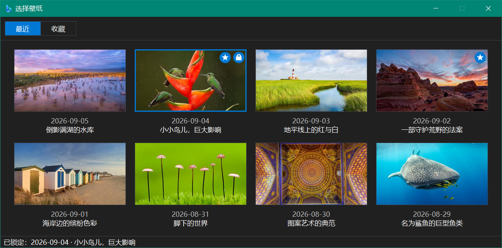

# 必应壁纸

一个干净、便携、开源的 Bing 每日壁纸客户端。

## 特性

- 常驻托盘，无主窗口，默认每小时检查一次今日壁纸
- 4K / 1080p 分辨率由客户端自己决定，不受接口返回值影响
- 支持 14 个常见市场，也可在配置文件里手填任意市场代码
- 壁纸选择窗口：「最近」8 天缩略图网格 +「收藏」，点击任意一张即设为壁纸并锁定
- 可锁定某一张壁纸，不再随检查间隔自动更换
- 随机轮播：从收藏夹里随机切换，一轮之内每张壁纸只出现一次，锁屏期间自动暂停
- 六种填充方式：填充 / 适应 / 拉伸 / 平铺 / 居中 / 跨区
- 切换壁纸时带有**淡入淡出**效果，而不是硬切
- 手写深色模式，**在 Windows 10 上同样有效**，可跟随系统实时切换
- 完全便携：配置、日志、壁纸全部位于程序目录，删除整个文件夹即可完整卸载
- 零第三方依赖，**单文件几百 KB 的可执行文件，无需安装任何运行时**

## 截图

| 浅色 | 深色 |
| :---: | :---: |
|  |  |
|  |  |



## 系统要求

- Windows 10 1903 (build 18362) 及以上，64 位
- **无需安装 .NET 运行时**：程序基于 .NET Framework 4.8，该版本自 Windows 10 1903 起随系统内置

## 安装与使用

1. 从 [Releases](../../releases) 下载 `BingWallpaper.zip` 并解压，得到一个 `BingWallpaper` 文件夹
2. 把这个文件夹放到一个**有写入权限**的位置，例如 `D:\Software\`
3. 启动文件夹里的 `BingWallpaper.exe`，托盘出现图标后即开始工作

### 配置文件

程序目录下的 `BingWallpaper.ini`，纯文本可手改，保存后重启程序生效：

```ini
[General]
Market=zh-CN              ; 市场代码，决定壁纸来自哪个频道；可设置为列出的 14 个常见市场，亦可填写任意代码
Resolution=UHD            ; 下载分辨率: UHD 或 1920x1080
Fit=Fill                  ; 填充方式: Fill / Fit / Stretch / Tile / Center / Span
FadeTransition=true       ; 换壁纸时淡入淡出: true 或 false
Theme=System              ; 界面主题: System / Light / Dark
RefreshIntervalHours=1    ; 检查间隔: 1 ~ 168 小时
Shuffle=false             ; 随机轮播收藏夹: true 或 false；PinnedWallpaper 非空时忽略
ShuffleIntervalMinutes=10 ; 轮播间隔: 1 ~ 1440 分钟
KeepDays=30               ; 壁纸保留天数: 0 表示永久保留，上限为 3650
RunAtStartup=false        ; 开机自启动: true 或 false
LogLevel=Info             ; 日志级别: Debug / Info / Warn / Error
PinnedWallpaper=          ; 锁定的壁纸文件名，留空表示跟随检查间隔自动更换
```

取值非法或超出范围时会被修正到最接近的合法值，并在日志里留下记录，不会因此启动失败。

## 与微软官方 Bing Wallpaper 的差异

这是本项目存在的核心理由。官方客户端会做的事情，本项目**一件都不做**：

| | 官方 Bing Wallpaper | 本项目 |
|---|---|---|
| 注入桌面右键菜单 | 会 | **不会** |
| 修改浏览器默认搜索引擎 / 主页 | 安装流程中会引导 | **不会** |
| 常驻推送资讯、广告、活动弹窗 | 会 | **不会** |
| 劫持桌面点击、附加桌面浮层 | 会 | **不会** |
| 安装到 `%LOCALAPPDATA%` 并注册卸载项 | 会 | **不会**，单文件便携 |
| 遥测 / 账号登录 | 有 | **无**，除 Bing 图片接口外不联网 |
| 卸载残留 | 有 | 删除文件夹即彻底卸载 |

本程序只做一件事：把 Bing 每日图片下载下来，并设为壁纸。

## 技术细节

<details>
<summary>实现细节与取舍，一般使用者不必阅读（点击展开）</summary>

- C# + WinForms（`net48`，C# 最新语言版本），UI 全部由代码构建，无窗体设计器、无 `.Designer.cs`
- JSON 用 `JavaScriptSerializer`（`System.Web.Extensions`，随 .NET Framework 内置）解析，
  因为 `System.Text.Json` 不属于 .NET Framework，而本项目不引入任何 NuGet 包
- 按系统 DPI 感知（`dpiAware=true`）+ `AutoScaleMode.Dpi` 缩放；.NET Framework 的 WinForms 只有在
  额外的 app.config 开关下才支持 PerMonitorV2，为保持单文件而放弃该特性（多显示器不同缩放时由系统拉伸）
- 显式套用系统 UI 字体（`SystemFonts.MessageBoxFont`）：.NET Framework 的控件默认字体仍是
  MS Sans Serif 8.25pt
- 图标是一个多分辨率 `.ico`（256/128/64/48/32/24/20/16），同一个文件既由 `ApplicationIcon` 编进 exe 的
  Win32 资源（资源管理器、任务栏、Alt+Tab），也作为嵌入资源打包：托盘按当前 DPI 要 16/20/24 像素，而
  `Icon.ExtractAssociatedIcon` 只会给出 32×32；窗口图标同样要显式赋值，WinForms 不继承 exe 图标
- 16/20/24 三帧是从 128 帧重采样生成的，不是逐级均值缩小：均值缩小出来的小帧笔画落在半像素上，
  标题栏和托盘里看着发虚
- 深色模式手写实现：读取 `AppsUseLightTheme` 注册表值（只读）、监听 `WM_SETTINGCHANGE`/`ImmersiveColorSet`、
  `DwmSetWindowAttribute(20)` 深色标题栏、`SetWindowTheme` + uxtheme 未文档化序号导出（#135 / #133 / #104）。
  所有未文档化调用均包在 try/catch 中，失败时降级为浅色并记录日志
- 换壁纸的淡入淡出是自己画的：`SPI_SETDESKWALLPAPER` 只让资源管理器重画壁纸层，那一下就是硬切，
  系统没有任何过渡可以开。做法是先把壁纸层现在的样子盖在桌面上，在盖住的状态下换壁纸，
  再把盖子的 alpha 走到 0——新图从旧图底下浮出来。先换后淡，之后任何一步出岔子最坏也只是变回硬切
- 盖子上的画面是**从壁纸层直接拷贝像素**（`GetDC(WorkerW)` + `BitBlt`），不是按填充方式重新渲染原图：
  一次显存内拷贝只要几毫秒，而全尺寸解码一张 UHD JPEG 再重采样到全屏要上百毫秒；更要紧的是拷来的
  画面与资源管理器画的**逐像素一致**，不必复刻排版规则，于是**六种填充方式都能淡入淡出**。
  DWM 允许拒绝这种拷贝（返回全黑），拷完采样九个点，全同色就判定失败，直接硬切并记 `WARN`
- 盖子挂在**壁纸层**而不是最顶层：向 `Progman` 发未文档化消息 `0x052C`，资源管理器会把桌面拆成
  「图标窗口 + 身后的 WorkerW」（它给幻灯片壁纸做淡入淡出用的就是这个拆分），盖子作为那个 WorkerW
  的分层子窗口挂进去。于是图标压在盖子上面、依旧可点，任何真实窗口都像遮住壁纸一样遮住它。
  找不到 WorkerW 就退回 `Progman` 并压到 z 序最底；再找不到就硬切
- 每帧只改一个 alpha 字节，位图只上传一次，合成交给 DWM，整个淡出几乎不吃 CPU；每帧用 GDI+ 做一次
  全屏 alpha 混合的话，4K 下单帧就是几十毫秒，根本淡不动。`SystemParametersInfoW` 放在线程池上跑——
  它返回前 Windows 要把图再完整解码并重新编码写出 `TranscodedWallpaper`，降频时轻松过一秒，
  而这段时间盖子正不透明地挡着，「界面卡住」于是变成「界面空闲」
- **盖子跑在自己的一条 UI 线程上**，淡完线程就退出：淡出每一帧靠 `WM_TIMER` 驱动，而它是消息队列里
  优先级最低的一种，留在主线程上时，连点排队的鼠标消息足以把整个淡出饿死——而且饿死不留痕迹，
  alpha 按时钟算，一帧没画到的淡出照样按时结束。顺带把跨进程挂子窗口带来的输入队列绑定也隔离在这里
- 连点时**不新建盖子，交给正在跑的那个**，于是连点十下是**一次从第一张平滑淡到最后一张的过渡**。
  若点击落在渐变已经开始之后，先用互补的 alpha 把底下的壁纸 `AlphaBlend` 进盖子的位图——得到的正是
  此刻屏幕上的合成图——再把 alpha 拉回 255，恢复不透明时一个像素都不动；这次混合只在中途接到改动时
  发生，不是每帧。壁纸本身则是**记住最后一张**，不排队也不丢弃，连点十下只跑两次「转码 + 写注册表」
- 淡出前按住不动的时长是量出来的：`hold = clamp(转码实测耗时, 150, 500) ms`。资源管理器画完新图不通知
  任何人，也没有可靠信号可等，太早降 alpha 透出来的会是**旧**壁纸；转码慢就说明这台机器此刻慢、
  画得也会慢，拿它当尺子最省事。淡出本身 500 ms，比系统给幻灯片壁纸的约 1 秒短——换壁纸是对点击的回应
- 建窗口带 `WS_EX_NOPARENTNOTIFY`（`CreateWindowEx` 会同步发 `WM_PARENTNOTIFY` 给资源管理器的窗口，
  这是整条路径上唯一的同步等待点），测量和建窗口时临时把线程切到 `PerMonitorV2`（进程按系统 DPI 感知，
  多显示器不同缩放时拿到的显示器矩形是主屏坐标系，壁纸层却是物理像素，盖子会盖不满）
- 代价是清楚的：全屏位图在 4K 下有几十 MB，所以淡完立刻释放，不留给下一次；嫌它多事就 `FadeTransition=false`
- 图片身份使用接口返回的 `startdate` 而非本地日期（zh-CN 市场在 UTC 16:00 换图）
- 缓存文件名不含市场代码：市场描述的是「从哪个频道拿到这张图」，不是图片本身的属性。
  身份取 `urlbase` 里的 `OHR.<名称>` 标记（`/th?id=OHR.WhyteCliffP_ZH-CN0573407830` → `WhyteCliffP`），
  它跨市场稳定，于是反复切换市场不会把同一张照片存成好几份
- 切换分辨率后，同一张图的旧尺寸副本会被清掉——但**只在当前分辨率那份确实存在时**才删，
  所以这一步只会去掉多余副本，永远不会删掉某张图的最后一份
- 下载先写 `.tmp`、校验通过后再原子改名，避免半截文件被当作有效缓存。校验只读文件头拿格式和尺寸，
  再查尾部的结束标记（JPEG 的 `FF D9` / PNG 的 `IEND`）确认没被截断——不做整图解码，
  否则一张 UHD 壁纸会为了回答「是不是图片」而瞬时占掉 30 MB 以上
- 全局异常钩子（`Application.ThreadException`、`AppDomain.UnhandledException`、`TaskScheduler.UnobservedTaskException`）
  会把完整异常链写入日志并弹出可复制文本的错误对话框
- 单选框 / 复选框为自绘控件：系统绘制的字形在深色背景下会变成「黑底黑点」，自绘后选中态在两种主题下
  都是强调色蓝
- 壁纸目录结构：程序目录下 `wallpapers\` 存每日缓存（受 `KeepDays` 管辖），`wallpapers\favorites\`
  存收藏，`wallpapers\.thumbs\` 是收藏缩略图缓存（可删除自动重建）
- 收藏是移动而非复制，磁盘上永远只有一份：清理只扫 `wallpapers\` 顶层，够不到 `favorites\`，
  所以「收藏永不被清理」是结构上的保证；取消收藏移回后按 `KeepDays` 重新计时，避免收藏了半年的图
  一移回去就被当成过期图删掉
- 支持直接把自己的图片拷进 `favorites\`：日期优先从文件名解析（`20250101` / `IMG_20250101_...` 都行），
  认不出来才退回文件修改时间。自备图没有「取消收藏」——没有可回的地方——改用右键删除到回收站
  （当前壁纸不许删）；Bing 的图反过来，只能取消收藏，不会被删掉
- 收藏夹以目录为唯一事实来源：「是不是收藏」就是「文件在不在 `favorites\`」，条目数、大小、排序
  全部来自开窗时的一趟目录枚举（`EnumerateFiles` 的 `Length` / `LastWriteTime` 枚举时已预填，不额外 stat）。
  `favorites.txt` 只缓存 Bing 图的标题和版权链接——接口只回溯 8 天，这两样过期就再也拿不回来，
  其余字段都能从目录和文件名推出来。于是用户手拷文件进来不是边缘情况，也不需要任何「对账」流程
- `favorites.txt` 是三列 TSV 而不是 JSON 或 CSV：`JavaScriptSerializer` 只能输出压成一行的 JSON，
  而 Bing 文案里逗号是常态、制表符从不出现，读就是 `Split('\t')`。扩展名用 `.txt` 而不是 `.csv`：
  后者关联 Excel，UTF-8 无 BOM 的中文会乱码，另存还会用 ANSI 重写
- 随机轮播、锁定壁纸、定时刷新是决定壁纸的三种模式，三者互斥：开启任一个即关掉另外两个。
  轮播开关和锁定都是先写 INI、写成功之后才改内存里的值，保存失败时程序和配置文件不会各说各话
- 轮播的顺序是「洗好的一整轮 + 一个游标」，不是消费型队列：一轮之内每张收藏各出现一次
  （Fisher-Yates 原地洗牌），新一轮若正好开在上一轮的收尾那张上，就与后面随机一张对调——
  n 张收藏时这本会每 n 轮撞上一次。游标换来了轮播中的「上一张」，也让中途增删收藏可以就地修补：
  删掉的从顺序里摘走并回退游标，新加的插进游标之后的随机位置、仍算本轮，而不必把这一轮作废重洗。
  顺序在每次换图前按目录重扫对齐一次——收藏夹仍是唯一事实来源
- 播放到哪儿不落盘：那是本次会话的状态，写出去要么把配置文件变成状态文件，要么给每次换壁纸
  添一次磁盘写。重启即新的一轮，从外面看与一次洗牌没有区别
- 锁屏时暂停轮播、解锁后重新起算间隔（`SystemEvents.SessionSwitch`）：没人看的时候消耗轮次没有意义。
  检查间隔的定时器照常跑——它只抓元数据、清理缓存，会去动桌面的只有「既没轮播也没锁定」那一种模式
- 缩略图网格是虚拟化的自绘控件，不是「每条一个控件」：条目在内存里是 struct，只绘制可见行，位图字典
  只保留可见区 ± 一屏，滑出即释放，于是开窗成本和内存占用与收藏总数无关。收藏图的缩略图缓存在
  `wallpapers\.thumbs\`（长边 320 逻辑像素、JPEG 质量 85，约 25 KB/张），由一个后台线程串行生成：
  首次要全尺寸解码 UHD JPEG（GDI+ 的中间位图约 33 MB），并发只会让内存峰值翻倍而不会更快
- 最近 8 天的缩略图按绘制它的格子宽度解码，而不是必应给的 400x240：8 张常驻位图从约 3 MB 降到约
  750 KB（100% DPI），缩放也从每次重绘一次变成每张图一次
- 下拉框改动延后 400 ms 落盘：下拉列表会把选择经过的每一格都报一次，滚轮一划或方向键按住不放，
  以前是每格写一次 INI、发一次 API 请求、换一次桌面壁纸。现在选择停稳了才写，界面仍然逐格跟随滚轮。
  关窗前会把挂起的改动补写掉，否则选完立刻关窗会静默丢失
- 刷新期间到来的触发不再被丢弃，而是记一笔、等当前这轮结束后补跑一次——以前是 `if (busy) return`，
  于是 INI 写着一个设置、桌面上却是另一个，没有任何东西去校正。防抖挡掉了连发，但挡不掉分属不同
  提交路径的两次改动（先改分辨率再改地区）和随时可能落下的定时刷新。补跑只需一次：下一轮重新读配置，
  自然落在最终值上（所以是一个标志位，不是队列）
- 不主动调 `GC.Collect` 或 `EmptyWorkingSet`。任务管理器里看到的涨落是 GC 堆在两次回收之间的
  锯齿（实测 1.7 → 7.2 MB），而进程提交量（Private Bytes）二十次切换地区只从 26.1 走到 27.0 MB——
  没有泄漏，也就没什么可回收的。`EmptyWorkingSet` 只把页挪到 standby list，提交量一分不减；
  强制压缩式 GC 实测反而让 Private Bytes 和工作集都微升，因为 CLR 压缩完会留着堆段复用
- 全球化功能保持启用：曾经开启的 `InvariantGlobalization`（.NET 10 时期）会让 WinForms 在切换输入法
  （`WM_INPUTLANGCHANGE` → `CultureInfo.GetCultureInfo(lcid)`）时直接崩溃

</details>

## 许可证

[GPL-3.0-or-later](LICENSE)
