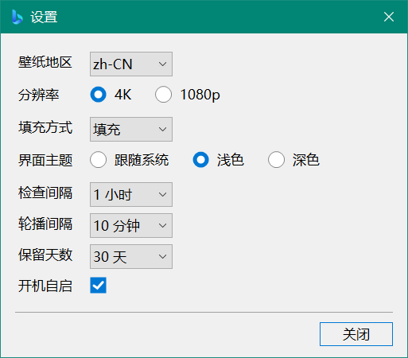
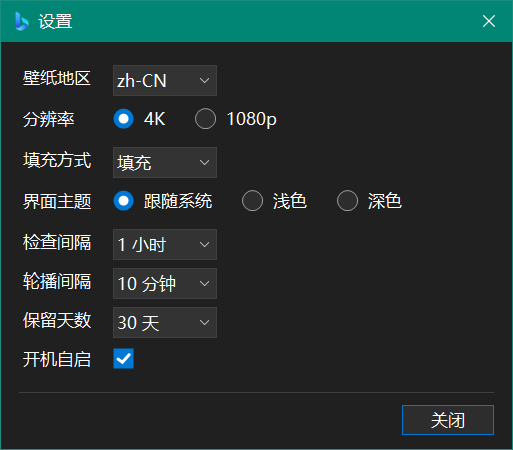
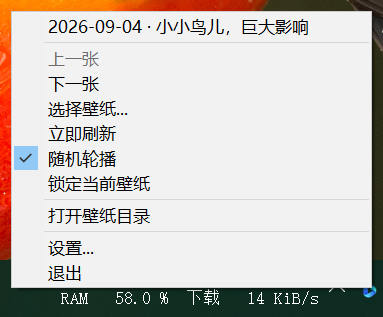
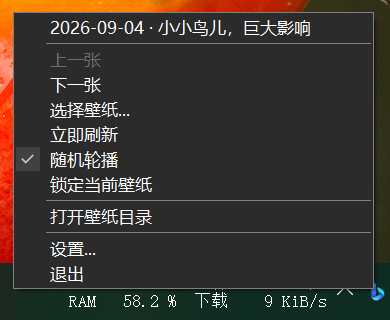
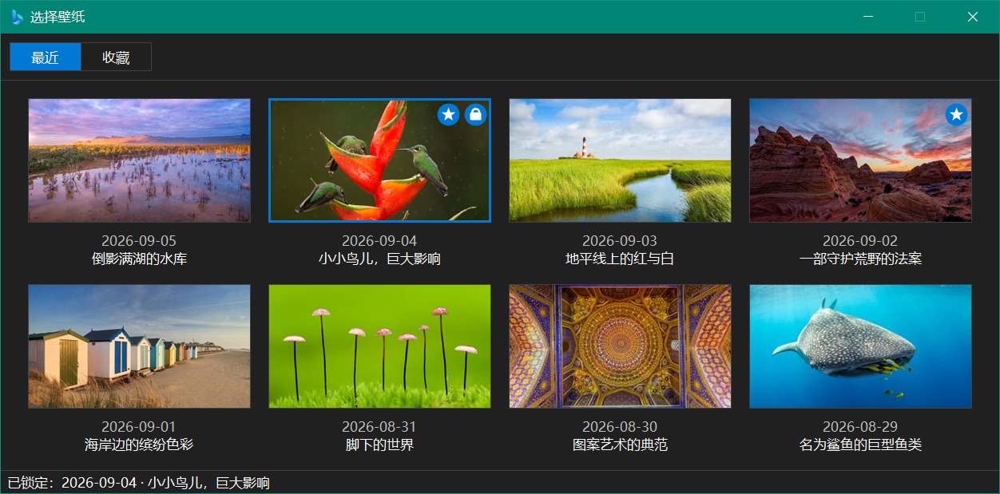

# 必应壁纸

一个干净、便携、开源的 Bing 每日壁纸客户端。

## 特性

- 常驻托盘，无主窗口，默认每小时检查一次今日壁纸
- 4K / 1080p 分辨率由客户端自己决定，不受接口返回值影响
- 支持 14 个常见市场，也可在配置文件里手填任意市场代码
- 壁纸选择窗口：「最近」15 天缩略图网格 +「收藏」，点击任意一张即设为壁纸并锁定
- 可锁定某一张壁纸，不再随检查间隔自动更换
- 随机轮播：从收藏夹里随机切换，一轮之内每张壁纸只出现一次，锁屏期间自动暂停
- 六种填充方式：填充 / 适应 / 拉伸 / 平铺 / 居中 / 跨区
- 切换壁纸时带有**淡入淡出**效果，而不是硬切
- 手写深色模式，**在 Windows 10 上同样有效**，可跟随系统实时切换
- 完全便携：配置、日志、壁纸全部位于程序目录，删除整个文件夹即可完整卸载
- 零第三方依赖，**单文件几百 KB 的可执行文件，无需安装任何运行时**

## 截图

| 浅色 | 深色 |
| :---: | :---: |
|  |  |
|  |  |



## 系统要求

- Windows 10 21H2 / LTSC 2021 (build 19044) 及以上，64 位
- **无需安装 .NET 运行时**：程序基于 .NET Framework 4.8，Windows 10 LTSC 2021 已内置

## 安装与使用

1. 从 [Releases](../../releases) 下载 `BingWallpaper.zip` 并解压，得到一个 `BingWallpaper` 文件夹
2. 把这个文件夹放到一个**有写入权限**的位置，例如 `D:\Software\`
3. 启动文件夹里的 `BingWallpaper.exe`，托盘出现图标后即开始工作

### 配置文件

程序目录下的 `BingWallpaper.ini`，纯文本可手改，保存后重启程序生效：

```ini
[General]
Market=zh-CN              ; 市场代码，决定壁纸来自哪个频道；可设置为列出的 14 个常见市场，亦可填写任意代码
Resolution=UHD            ; 下载分辨率: UHD 或 1920x1080
Fit=Fill                  ; 填充方式: Fill / Fit / Stretch / Tile / Center / Span
FadeTransition=true       ; 换壁纸时淡入淡出: true 或 false
Theme=System              ; 界面主题: System / Light / Dark
RefreshIntervalHours=1    ; 检查间隔: 1 ~ 168 小时
Shuffle=false             ; 随机轮播收藏夹: true 或 false；PinnedWallpaper 非空时忽略
ShuffleIntervalMinutes=10 ; 轮播间隔: 1 ~ 1440 分钟
KeepDays=30               ; 壁纸保留天数: 0 表示永久保留，上限为 3650
RunAtStartup=false        ; 开机自启动: true 或 false
LogLevel=Info             ; 日志级别: Debug / Info / Warn / Error
PinnedWallpaper=          ; 锁定的壁纸文件名，留空表示跟随检查间隔自动更换
```

取值非法或超出范围时会被修正到最接近的合法值，并在日志里留下记录，不会因此启动失败。

## 与微软官方 Bing Wallpaper 的差异

这是本项目存在的核心理由。官方客户端会做的事情，本项目**一件都不做**：

| | 官方 Bing Wallpaper | 本项目 |
|---|---|---|
| 注入桌面右键菜单 | 会 | **不会** |
| 修改浏览器默认搜索引擎 / 主页 | 安装流程中会引导 | **不会** |
| 常驻推送资讯、广告、活动弹窗 | 会 | **不会** |
| 劫持桌面点击、附加桌面浮层 | 会 | **不会** |
| 安装到 `%LOCALAPPDATA%` 并注册卸载项 | 会 | **不会**，单文件便携 |
| 遥测 / 账号登录 | 有 | **无**，除 Bing 图片接口外不联网 |
| 卸载残留 | 有 | 删除文件夹即彻底卸载 |

本程序只做一件事：把 Bing 每日图片下载下来，并设为壁纸。

## 技术细节

实现细节与取舍见 [技术细节文档](docs/tech.md)，一般使用者不必阅读。

## 许可证

[GPL-3.0-or-later](LICENSE)
